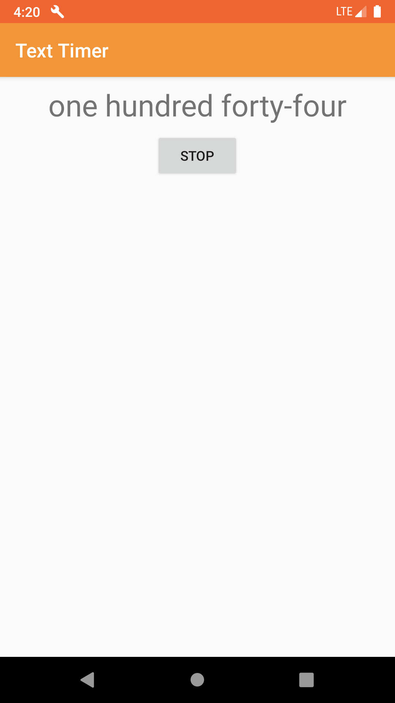

# Text Timer


The project is a simple Android application with two activities developed in [Kotlin](https://github.com/JetBrains/kotlin) as a training task at the very start of the Android App Development Course by the [Technotrack](https://track.mail.ru/) educational project. The application represents a stopwatch, which counts upwards from zero for measuring elapsed time, showing the time in the way how we pronounce it, e.g. _forty four_ for 44. The interface is available in English and in Russian. Appropriate language will be applied, depending on your system language.

## Usage

Splash Screen                       | Before Start                       | After Start
:----------------------------------:|:----------------------------------:|:---------------------------------:
 |  | 

When you stop the timer, you can continue from the point of stopping by clicking on the start. At the expiration of 1000 seconds, the timer will stop, and then you can start again from zero.

## Building

Run [Gradle](https://github.com/gradle/gradle) from the root directory of the project to build it.

``` bash
./gradlew build
```

After completion there will be two directories in app/build/outputs/apk with apk files for debug and release.

## License

[MIT](LICENSE) © [alxiw](https://github.com/alxiw)
